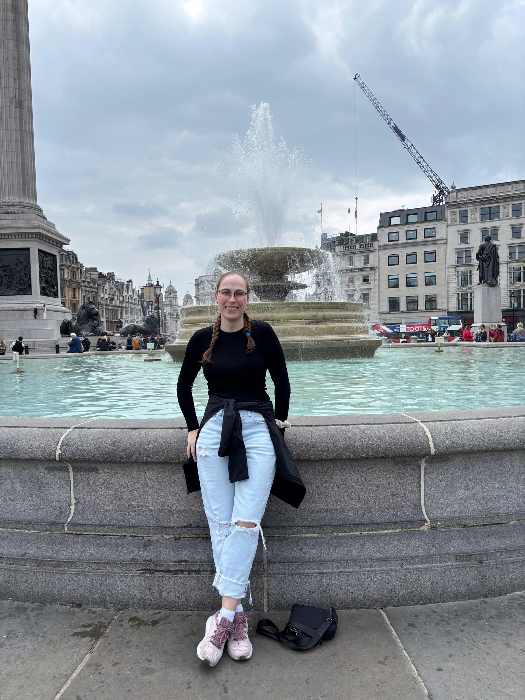
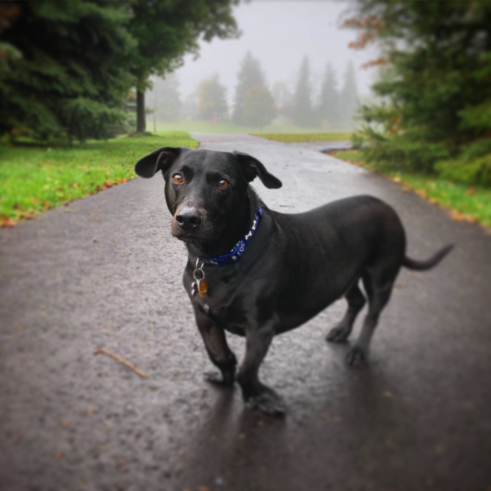

# Multimedia Authoring Assignment One: NEED GROUP NAME

## About Me

Hi! My name’s Crystal. 

&nbsp;&nbsp;I grew up in the London area, though I’ve lived in more than a dozen places between *Port Burwell, Ontario*, and *Tweed, Ontario*. 

&nbsp;&nbsp;I have a degree in English Literature from Western University and enjoy writing books in my spare time. 

## My Hobbies

&nbsp;&nbsp;I spend most of my time: 

* Watching movies or television 
* Writing 
* Travelling 
* Or trying new things with code 

&nbsp;&nbsp;I am currently developing a mobile app for writers which aims to better organize the writing process for those who like to write on the go.

&nbsp;&nbsp;My Favourite Television and Movie Genres Are: 

* Stand-Up Comedy
* Rom-Coms
* Sports movies where the underdog comes out on top

&nbsp;&nbsp;My perfect day would be roaming through the streets of New York City or London, England, though the next place I’d like to travel to is Seoul, South Korea.  

___

## STORM

Hello! My name is Storm, and I am 18 years old.

I am from *London, Ontario*, but I have previously lived in *Waterloo, Ontario*, and in *Patuanak, Saskatchewan*.

I have a dog named Kobi; he is 12 years old and a mix between a Black Lab and a Jack Russell Terrier.

## My Hobbies

The majority of my time goes into: 

**Art**
- Sketching
- Colouring with Prismacolours
- Adobe Illustrator

**Video Games**
- Valorant
- Apex Legends
- Harvest Moon series

In high school, I had the opportunity to participate in an animation competition. Although my team did not win, I learned many valuable skills from that experience. 

My favourite anime series and movies are:

- Black Clover
- Haikyu!!
- Your Name
- I Want to Eat Your Pancreas
___

## VAL ADD YOUR CONTENT HERE

___

## Installation 

No installation is required

## Usage 

This is for homework 1 of our multi-authoring course.

## Contributing 

1. Want to use this template? Fork it!
2. Clone the repo and remember to use branches.
3. Make any adjustments you would like.
4. Push to the main branch.
5. Submit a pull request and wait for it to be merged.
6. Congratulations! Your changes will now be visible in your forked version of the repo.

## Credits

- Crystal Underhill
- Storm MacAinsh
- Valentina Rengifo

## License 

An MIT License was used; see the license file for more detailed information.